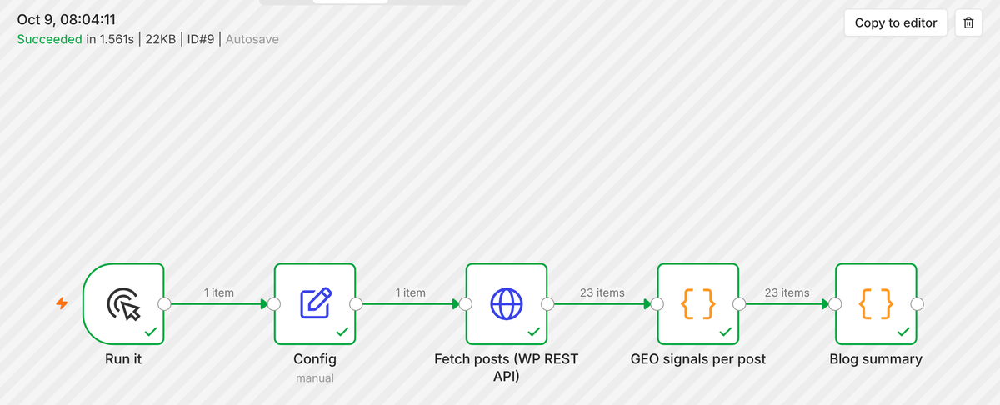

# geo-visibility-tracker

[](https://github.com/SametAtas/geo-visibility-tracker/actions/workflows/ci.yml)

This project measures how a brand shows up in AI answers, and says how sure that measurement is. I built it around the work an SEO/GEO agency does every week:
- check whether AI assistants recommend a client;
- audit the client's WordPress content for the signals AI answers favour;
- automate both in n8n.

It contains a Python package, a WordPress plugin in PHP, SQL views and n8n workflows. All of it is tested, and the parts that talk to WordPress and n8n were tested against the real thing.

## Why repeat every question

Ask an AI the same question twice and you get different answers. A tool that checks each keyword once and reports "visible: yes" is mostly reporting luck. So here every question is asked several times, every rate comes with a 95% interval, and a week-over-week change is only called real when a significance test agrees.

**A real run shows why.** I asked 6 everyday shopping questions in Traditional Chinese, 5 times each, and tracked 13 Taiwanese platforms ([experiments/ecommerce_tw](experiments/ecommerce_tw)).
- The big three were stable: 蝦皮 30/30, momo 28/30, PChome 26/30.
- Below them, **60% of question-platform pairs appeared in some runs but not others**.
- A single check disagreed with the majority of runs 17% of the time.
- For the next-day-delivery question, 酷澎 (Coupang) was named in 1 of 5 runs.

The raw answers are in the repo, and the report [opens in the browser](https://htmlpreview.github.io/?https://github.com/SametAtas/geo-visibility-tracker/blob/main/docs/report_ecommerce_tw.html).

## What's inside

**Visibility tracking (Python, `geo_tracker/`)**
- Asks each question N times through any OpenAI-compatible API, or replays saved answers.
- Separates *mentions* (brand named) from *citations* (brand linked).
- Computes rates with Wilson intervals and share of voice, tests changes against the previous period, and reports run-to-run stability and the names the AI recommends that you aren't tracking yet.
- Runs are resumable: a quota error or a crash loses nothing, and the next run continues.

**SQL (`geo_tracker/warehouse.py`, `queries/`)**
- Derived tables and views over the raw answers: rates with intervals, `LAG` for change vs last period, window sums for share of voice, per-keyword stability.
- Tests check every view against the Python numbers.

**WordPress plugin (PHP, `wordpress-plugin/geo-signals/`)**
- Adds a column to the Posts screen and two read-only REST endpoints for n8n.
- It counts the signals the GEO paper (Aggarwal et al., KDD 2024) links to visibility in AI answers: cited sources, statistics, quotations, plus FAQ sections and freshness.


**n8n (`n8n/`)**
- Five workflows, imported into n8n 2.42.5. Four of them were executed there; the fifth, an Error Trigger, only fires on scheduled runs. The audit workflow paginates through a real WordPress and agrees with the plugin on every post.



**Also:** a question bank mined from forum titles (PTT/Dcard style), a fact-checker for AI-written comparison tables, a FastAPI service, and a Google Apps Script version of the audit.

## One set of rules, three languages

The content audit exists in Python, PHP (the plugin) and JavaScript (the n8n Code node). They all run on one shared test file, `tests/fixtures/signals_cases.json`.

Before that file existed, the JavaScript version disagreed with Python on 4 of 5 cases:
- look-alike domains counted as the site's own;
- full-width digits like `３０％` ignored;
- "Q & A" headings missed;
- 12.5% rounded to 13%.

None of these raised an error. On a real WordPress (6.5 and 7.1 in CI), Python and PHP now agree on all 23 test posts, and n8n gives the same blog summary.

The full list of what testing caught is in [docs/FINDINGS.md](docs/FINDINGS.md).

## Run it

```bash
git clone https://github.com/SametAtas/geo-visibility-tracker && cd geo-visibility-tracker
pip install -e ".[api,dev]"
python -m geo_tracker demo                 # whole pipeline on sample data -> demo_output/report.html
pytest -q                                  # unit, API and SQL tests
python -m geo_tracker sql --config examples/demo/config.toml --db demo_output/demo.db queries/visibility.sql
```

To measure for real, point it at any OpenAI-compatible endpoint. The key is read from the environment only:

```bash
export GEO_LLM_BASE_URL=...  GEO_LLM_API_KEY=...  GEO_LLM_MODEL=...
python -m geo_tracker collect --config experiments/ecommerce_tw/config.toml --date 2026-10-09
python -m geo_tracker report  --config experiments/ecommerce_tw/config.toml --date 2026-10-09 --engine $GEO_LLM_MODEL
```

To test the plugin, `tests/wordpress/setup_wordpress.sh` starts WordPress on SQLite with PHP's built-in server. Then run `GEO_WP_URL=http://127.0.0.1:8899 pytest tests/test_wordpress_live.py`.

## How it is tested

CI runs on every push:
- `pytest` on Python 3.11 and 3.13;
- the demo pipeline end to end;
- [rein](https://github.com/SametAtas/rein), my deterministic code checker;
- the Apps Script logic;
- the n8n Code nodes on the shared cases;
- for WordPress 6.5.13 and 7.1.3: a real install with the plugin, then Python vs PHP on every post.

## Docs

- [docs/PRD.md](docs/PRD.md): users, scenarios, scope, what to automate and what a person should check.
- [docs/DECISIONS.md](docs/DECISIONS.md): why it is built this way.
- [docs/FINDINGS.md](docs/FINDINGS.md): bugs and traps found by testing.
- [docs/DATA_FLOW.md](docs/DATA_FLOW.md): the pipeline as a diagram.

## Limits

- An API answer is not the same as ChatGPT's app or Google's AI Overviews. A licensed data provider could plug in behind the same `ask(keyword, run)` interface.
- Runs of the same question are treated as independent; they aren't fully, so the real uncertainty is a bit larger than the intervals show.
- Question grouping uses character bigrams. It merges rewordings but not synonyms written with different characters.
- The fact-checker compares text and numbers. It doesn't judge meaning, so unclear cells go to a person.

## 中文摘要

這個專案用來衡量品牌在 AI 回答中的能見度，並誠實標示不確定性：同一個問題會詢問多次，分開計算「被提及」與「被引用（附連結）」，附上 95% 信賴區間；週與週之間的變化會做顯著性檢定，避免把隨機波動當成成效。另外包含：WordPress 外掛（PHP，在文章列表顯示 GEO 指標並提供 REST API）、SQL 檢視表、在 n8n 2.42.5 實際執行過的工作流程、論壇問題整理，以及 AI 比較表格查核。同一套內容檢查規則以 Python、PHP、JavaScript 三種語言實作，並用同一份測試資料確認結果一致。

## License

MIT
