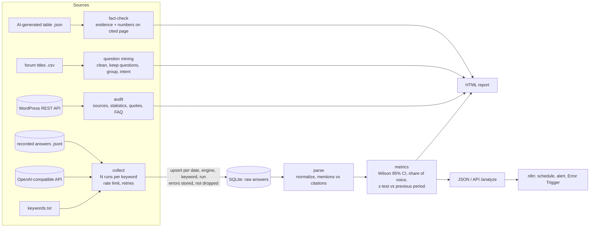

# Data flow

**Principles:**
- **Raw first.** Answers are stored exactly as received; every number is recomputed from them.
- **Idempotent.** A unique key plus upsert means re-running any day is safe.
- **Nothing disappears silently.** Empty answers and errors are stored and shown in the report's data-quality table.
- **Untrusted text.** Answers, configs and fetched pages are escaped before they reach HTML.
