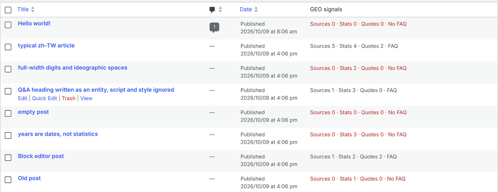

# GEO Signals (WordPress plugin)

Shows, for every published post, the things the GEO paper (Aggarwal et al., KDD 2024) links to being used in AI answers: how many outside sources it cites, how many statistics and quotations it has, whether it has an FAQ section, and when it was last updated.

**What it adds**

- A "GEO signals" column on *Posts*. Posts that cite no outside source are shown in red, because that is usually the first thing to fix.
- `GET /wp-json/geo-signals/v1/posts?per_page=20&page=1`: posts with their signals. It sends `X-WP-Total` and `X-WP-TotalPages` like the core endpoints, so the same pagination code works.
- `GET /wp-json/geo-signals/v1/summary`: the whole blog in one object, for a weekly n8n check (`n8n/wordpress_plugin_check_workflow.json`).

The endpoints are public on purpose: they only return numbers derived from posts that `/wp/v2/posts` already publishes. Drafts never appear.

**How it works**

- `includes/signals.php` holds the rules as plain PHP with no WordPress calls, so it can be tested without WordPress.
- Signals are computed from the rendered content (the same HTML the REST API returns), once per save, and cached in post meta. The cache is keyed to the post's modification time and the plugin version, so editing a post or upgrading the plugin refreshes it.
- Uninstalling removes the cached meta. Nothing else is stored.

**How it is tested**

- `tests/php/test_signals.php` runs the PHP rules on `tests/fixtures/signals_cases.json`. The Python audit and the n8n Code node are tested on the same file, so all three must give the same numbers.
- `tests/wordpress/setup_wordpress.sh` starts a real WordPress (7.1.3 by default, on SQLite, with PHP's built-in server) and installs the plugin. `tests/test_wordpress_live.py` then checks, on 23 posts:
  - the Python audit (through the core REST API) and the plugin agree on every post and on the summary;
  - a site timezone of Asia/Taipei doesn't shift the update dates;
  - drafts stay hidden;
  - the admin column renders;
  - saving a post recomputes its signals.

  CI runs all of this on every push.

**Install:** copy the `geo-signals` folder into `wp-content/plugins/` and activate it. Needs PHP 8.1+ and WordPress 6.5+. CI tests it on WordPress 6.5.13 and 7.1.3 with PHP 8.3.
